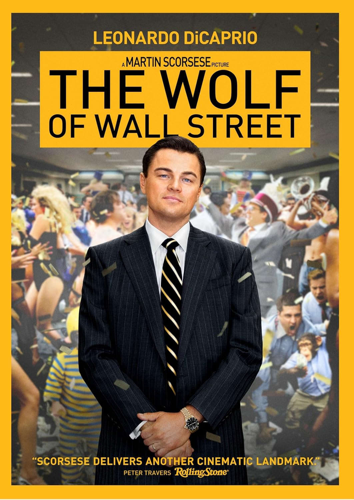
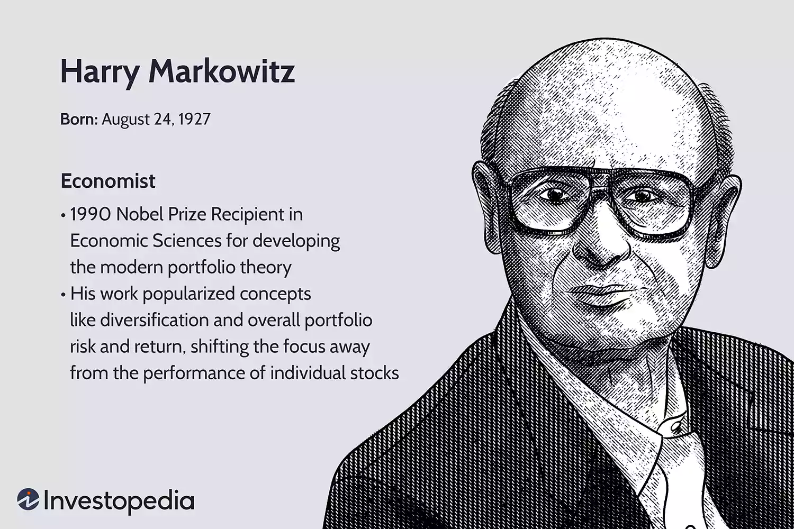
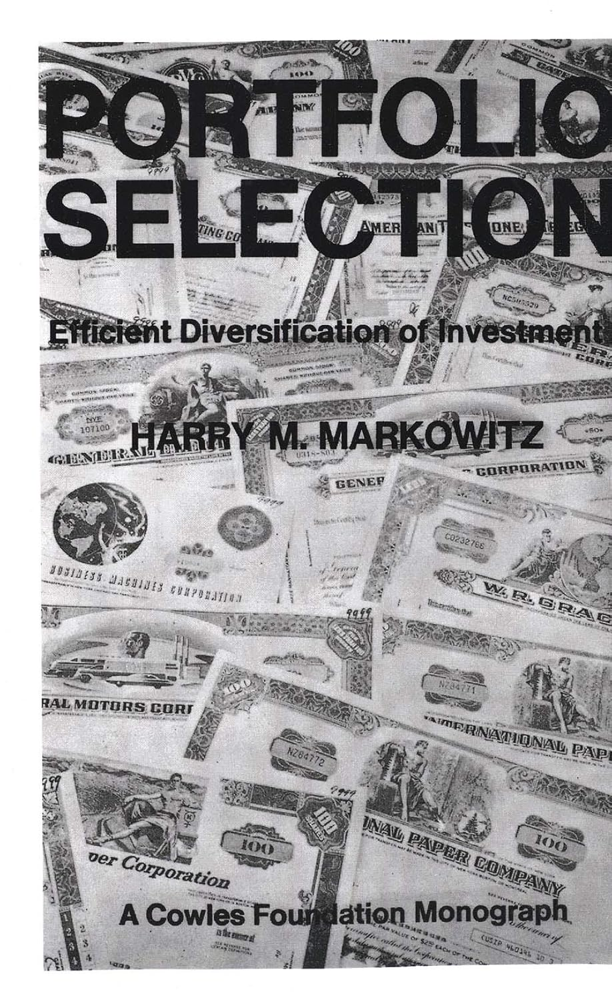
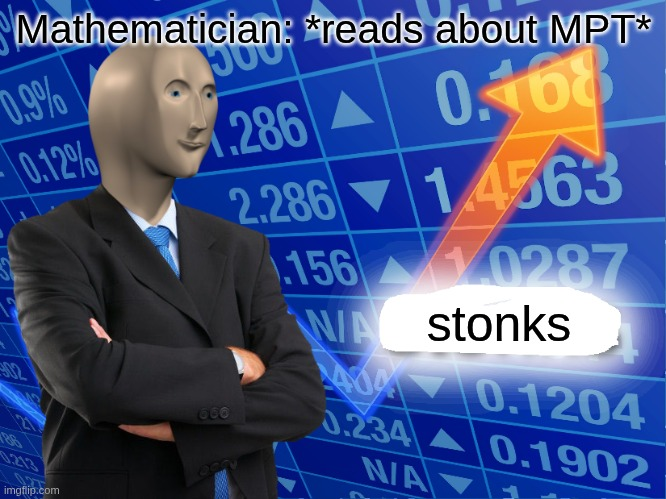
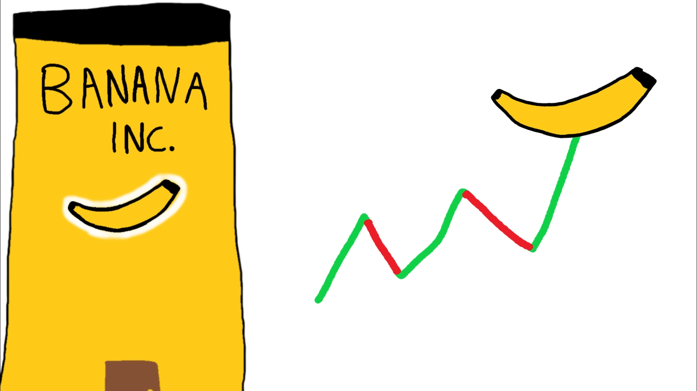
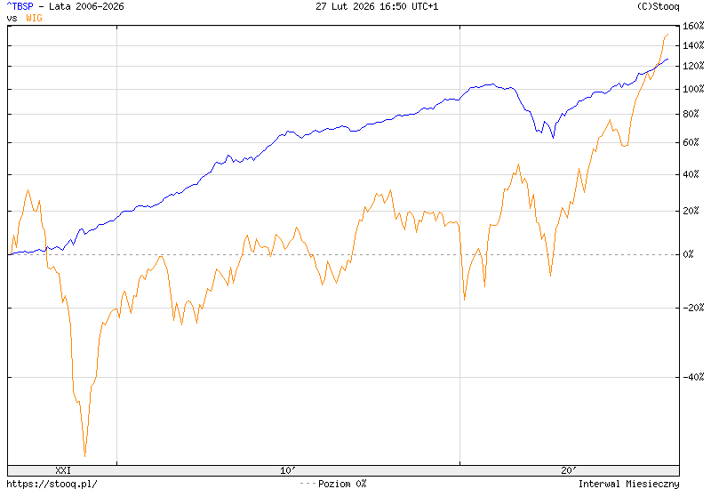
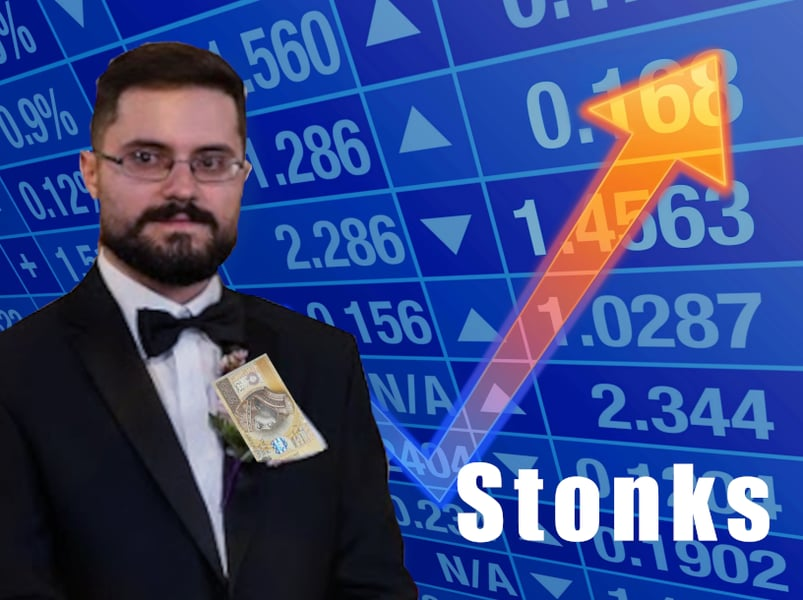

```{r setup}
pkgload::load_all()
library(shinyWidgets)
```

## Zastrzeżenie

Niniejsza prezentacja ma charakter wyłącznie edukacyjny i nie stanowi rekomendacji finansowej. Żadna część tego materiału nie powinna być traktowana jako doradztwo inwestycyjne ani jako podstawa do podejmowania decyzji inwestycyjnych lub transakcji na rynkach finansowych.

#
{fig-align="center"}

:::{.notes}
American biographical dark comedy crime film co-produced and directed by Martin Scorsese
:::

## Co to znaczy zostać wilkiem z Wall Street?
:::{.incremental}
- bogactwo?
- inwestowanie na giełdzie?
- przestrzegając prawa?
- jak wykorzystać do tego matematykę?
- clickbait
:::

## Jak matematyk zadałby takie pytanie?
:::{.incremental}
- Mamy dostępne papiery wartościowe na giełdzie
- Które z nich wybrać, żeby zyskać najwięcej?
- I najmniej ryzykować?
- Jak to sformalizować problem?
:::

## Formalizacja problemu
$$
\begin{equation}
    \begin{aligned}
        & \underset{w}{\text{max}} & & \mu(w) \quad \text{(Zwrot)} \\
        & \text{pod warunkiem} & & \sigma(w) \leq const \quad \text{(Ryzyko)}
    \end{aligned}
\end{equation}
$$

## a może inaczej?
$$
\begin{equation}
    \begin{aligned}
        & \underset{w}{\text{min}} & & \sigma(w) \quad \text{(Ryzyko)} \\
        & \text{pod warunkiem} & & \mu(w) \geq const \quad \text{(Zwrot)}
    \end{aligned}
\end{equation}
$$

## Cel
1. Zdefiniować zwrot/zysk $\mu$.
2. Zdefiniować ryzyko $\sigma$.
3. Znaleźć optymalne $w$.

# Współczesna teoria portfelowa

## Współczesna teoria portfelowa
1. Papiery wartościowe,
2. Ryzyko i zwrot,
3. Portfel rynkowy,
4. Optymalna inwestycja

:::{.notes}
Badanie optymalnej alokacji majątku pomiędzy poszczególne aktywa w portfelu inwestycyjnym, oparte na dwuetapowym celu maksymalizacji stopy zwrotu przy jednoczesnej minimalizacji ryzyka.
:::

## Harry Markowitz
:::: {.columns}

::: {.column width="67%"}

:::

::: {.column width="33%"}

:::
::::


##


# 1. Papiery wartościowe

## Papiery wartościowe
:::{.incremental}
- akcje
- obligacje
- kontrakty, towary, kryptowaluty
- fundusze inwestycyjny notowany na giełdzie (exchange-traded fund, ETF)
:::

## Akcje


## Akcje (c.d.)
:::{.incremental}
- polskie (GPW, WIG20):
  - ALE,
  - CDR,
  - ZAB 
- amerykańskie (NYSE, SP500): 
  - NVDA,
  - AAPL,
  - AMZN 
:::

## Obligacje


## Obligacje (c.d.)
- skarbowe:
  - Skarbowe Papiery Wartościowe (PL),
  - Bunds (DE),
  - OAT (FR),
  - Gilts (UK),
  - Treasuries (USA)
- korporacyjne

## Kontrakty, towary i krypto
:::: {.columns}

::: {.column width="50%"}

:::

::: {.column width="50%"}

:::
::::

## Kontrakty, towary i krypto (c.d.)
- kontrakty na:
  - waluty (EURPLN, USDEUR),
  - indeksy (WIG20, NASDAQ, SP500)
- towary:
  - złoto (XAUUSD, XAUPLN)
  - świńskie tusze (? Lean Hog futures)
- kryptowaluty? (BTC, ETH)

## Exchange-traded fund, ETF


## Exchange-traded fund, ETF (c.d.)
- globalne:
  - akcje (VWRA.L, VWCE.DE)
  - obligacje (AGGU.L, EUNA.DE)
- indeksy (WIG20, SP500)
- sektory (AI, blockchain, finanse)
- towary i inne (złoto, BTC)

## Losowość {.smaller}

```{r}
mod_price_plots_ui("price_plots")
```

```{r}
#| context: server
mod_price_plots_server("price_plots")
```


# 2. Ryzyko i zwrot

## Zwrot
- Celem inwestora jest wzrost majątku.
- Wartości końcowe pap. wart. są niepewne*.
- Stopy zwrotu modeluje się jako zmienne losowe.
- Jedną miarą oceny jest wartość oczekiwana stopy zwrotu.


## Notacja
$S_0$ to obecna (znana) cena, $S_t$ to przyszła (nieznana) cena po okresie $t$, którą nazywamy zmienną losową:

$$
S_t: \Omega \to \left[0, \infty \right),
$$
np. $S_t(\omega_1) = 50$, $S_t(\omega_2) = 100$.

Scenariusze $\omega_1, \omega_2, \ldots$, mają swoje prawdopodobieństwa:

$$
P(\omega_1) = 60\%, \quad P(\omega_2) = 40\%.
$$

## Wartość oczekiwana zm. los.

$$
\begin{align}
\mathbb{E}(S_t) &= \sum_{\omega \in \Omega} S_t(\omega)\,P(\omega) \\
                &= S_t(\omega_1)P(\omega_1) + S_t(\omega_2)P(\omega_2) \\
                &= 50 \cdot 0.6 + 100 \cdot 0.4 \\
                &= 70.
\end{align}
$$

## Prawo Wielkich Liczb**
Jeżeli $X_i$ to niezależne pomiary losowe** to:
$$
\frac{1}{n} \sum_{i=n}^{\infty} X_i \to \mathbb{E}(X_1),
$$
co pozwala nam na przybliżenie wartości oczekiwanej średnią artymetyczną!**

## Zwrot
Zwrot jest zmienną losową, bo nie jest znane $S_t$:
$$
K_t = \frac{S_t - S_0}{S_0},
$$
a ze względu na liniowość wartości oczekiwanej
$$
\mu = \mathbb{E}(K_t) = \frac{\mathbb{E}(S_t) - S_0}{S_0}.
$$

## Przykłady {.smaller}
```{r}
mod_last_returns_ui("last_returns")
```
```{r}
#| context: server 
mod_last_returns_server("last_returns")
```

## Ryzyko


## Ryzyko (c.d.)
- Ryzyko wynika z niepewności przyszłych wartości pap. wart.
- Większy rozrzut możliwych wyników, wyższe ryzyko.
- Jedną miarą ryzyka jest zmienność (rozproszenie) stóp zwrotu.
- Inwestorzy maksymalizują zwrot przy ograniczaniu ryzyka.


## Wariancja i odchylenie
Wariancja zwrotu:
$$
\mathrm{Var}(X) = \mathbb{E}(K - \mu)^2,
$$
i odchylenie standarowe:
$$
\sigma = \sqrt{\mathrm{Var}(X)}.
$$

## Przykłady {.smaller}
```{r}
mod_stocks_summary_ui("summary")
```
```{r}
#| context: server 
mod_stocks_summary_server("summary")
```


## Źródła

Capiński M. J., Kopp, E., Portfolio Theory and Risk Management

## Dziękuję za uwagę

