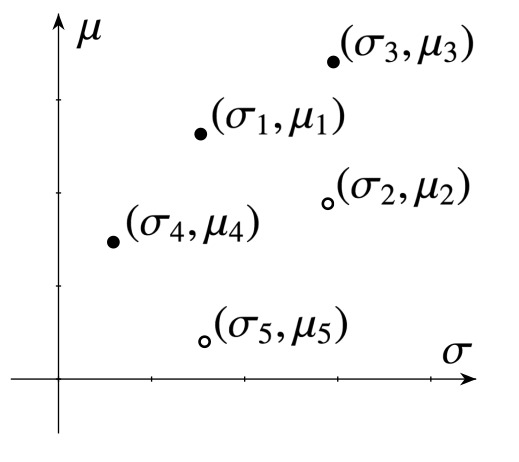
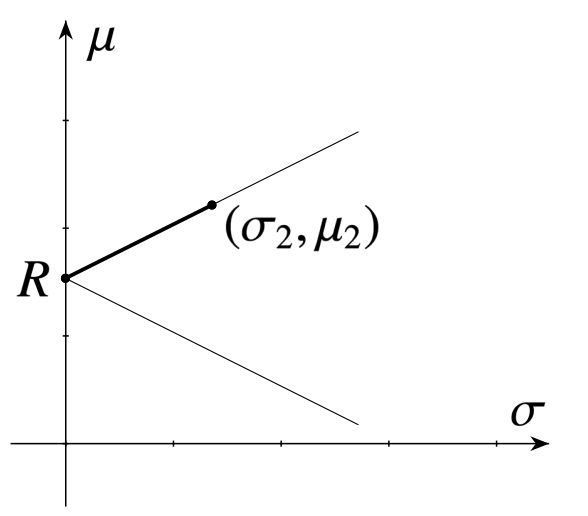
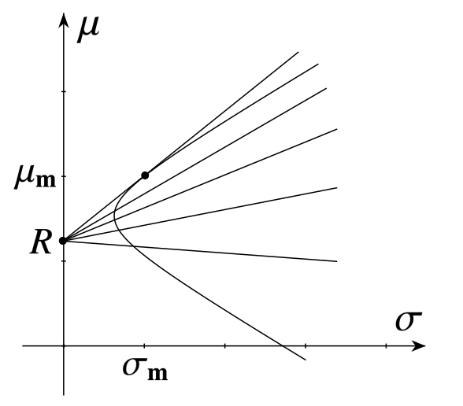
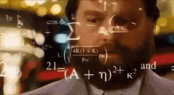

```{r setup}
library(fmwmpt)
library(shinyWidgets)
```

## Zastrzeżenie

Niniejsza prezentacja ma charakter wyłącznie edukacyjny i nie stanowi rekomendacji finansowej. Żadna część tego materiału nie powinna być traktowana jako doradztwo inwestycyjne ani jako podstawa do podejmowania decyzji inwestycyjnych lub transakcji na rynkach finansowych.

#


:::{.notes}
American biographical dark comedy crime film co-produced and directed by Martin Scorsese
:::

## Co to znaczy zostać wilkiem z Wall Street?
:::{.incremental}
- bogactwo?
- inwestowanie na giełdzie?
- przestrzegając prawa?
- jak wykorzystać do tego matematykę?
- clickbait
:::

## Jak sformalizowałby to matematyk?
:::{.incremental}
- Mamy dostępne papiery wartościowe na giełdzie
- Które z nich wybrać, żeby zyskać najwięcej?
- I najmniej ryzykować?
- Jak to zapisać matematycznie?
:::

## Formalizacja problemu
$$
\begin{equation}
    \begin{aligned}
        & \underset{w}{\text{max}} & & \mu(w) \quad \text{(Zwrot)} \\
        & \text{pod warunkiem} & & \sigma(w) \leq const \quad \text{(Ryzyko)}
    \end{aligned}
\end{equation}
$$

## a może inaczej?
$$
\begin{equation}
    \begin{aligned}
        & \underset{w}{\text{min}} & & \sigma(w) \quad \text{(Ryzyko)} \\
        & \text{pod warunkiem} & & \mu(w) \geq const \quad \text{(Zwrot)}
    \end{aligned}
\end{equation}
$$

## Cel
1. Zdefiniować zwrot/zysk $\mu$.
2. Zdefiniować ryzyko $\sigma$.
3. Znaleźć optymalne $w$.

# Współczesna teoria portfelowa

## Współczesna teoria portfelowa
1. Aktywa na giełdzie,
2. Ryzyko i zwrot,
3. Portfele inwestycyjne,
4. Optymalna inwestycja.

:::{.notes}
Badanie optymalnej alokacji majątku pomiędzy poszczególne aktywa w portfelu inwestycyjnym, oparte na dwuetapowym celu maksymalizacji stopy zwrotu przy jednoczesnej minimalizacji ryzyka.
:::

## Harry Markowitz
:::: {.columns}

::: {.column width="67%"}

:::

::: {.column width="33%"}

:::
::::


##


# 1. Aktywa

## Aktywa dostępne na giełdzie
- akcje
- obligacje
- kontrakty, towary, kryptowaluty
- fundusze inwestycyjne notowany na giełdzie (exchange-traded fund, ETF)
- i inne...

## Akcje


## Akcje (c.d.)
:::{.incremental}
- polskie (GPW, WIG20):
  - ALE,
  - CDR,
  - ZAB
- amerykańskie (NYSE, SP500):
  - NVDA,
  - AAPL,
  - AMZN
:::

## Obligacje


## Obligacje (c.d.)
- skarbowe:
  - Skarbowe Papiery Wartościowe (PL),
  - Bunds (DE),
  - OAT (FR),
  - Gilts (UK),
  - Treasuries (USA)
- korporacyjne

## Kontrakty, towary i krypto
:::: {.columns}

::: {.column width="50%"}

:::

::: {.column width="50%"}

:::
::::

## Kontrakty, towary i krypto (c.d.)
- kontrakty na:
  - waluty (EURPLN, USDEUR),
  - indeksy (WIG20, NASDAQ, SP500)
- towary:
  - złoto (XAUUSD, XAUPLN)
  - świńskie tusze (? Lean Hog futures)
- kryptowaluty (BTC, ETH)

## Exchange-traded fund, ETF


## Exchange-traded fund, ETF (c.d.)
- globalne:
  - akcje (VWRA.L, VWCE.DE)
  - obligacje (AGGU.L, EUNA.DE)
- indeksy (WIG20, SP500)
- sektory (AI, blockchain, finanse)
- towary i inne (złoto, BTC)

## Losowość {.smaller}

```{r}
mod_price_plots_ui("price_plots")
```

```{r}
#| context: server
mod_price_plots_server("price_plots")
```


# 2. Ryzyko i zwrot

## Zwrot
- Celem inwestora jest wzrost majątku.
- Wartości końcowe aktywów są niepewne*.
- Stopy zwrotu modeluje się jako zmienne losowe.
- Jedną miarą oceny jest wartość oczekiwana stopy zwrotu.


## Notacja
$S_0$ to obecna (znana) cena, $S$ to przyszła (nieznana) cena po okresie $t$, którą nazywamy zmienną losową:

$$
S: \Omega \to \left[0, \infty \right),
$$
np. $S(\omega_1) = 50$, $S(\omega_2) = 100$.

Scenariusze $\omega_1, \omega_2, \ldots$, mają swoje prawdopodobieństwa:

$$
P(\omega_1) = 60\%, \quad P(\omega_2) = 40\%.
$$

## Wartość oczekiwana zm. los.

$$
\begin{align}
\mathbb{E}(S) &= \sum_{\omega \in \Omega} S(\omega)\,P(\omega) \\
                &= S(\omega_1)P(\omega_1) + S(\omega_2)P(\omega_2) \\
                &= 50 \cdot 0.6 + 100 \cdot 0.4 \\
                &= 70.
\end{align}
$$

## Prawo Wielkich Liczb**
Jeżeli $X_i$ to niezależne pomiary losowe** to:
$$
\frac{1}{n} \sum_{i=n}^{\infty} X_i \to \mathbb{E}(X_1),
$$
co pozwala nam na przybliżenie wartości oczekiwanej średnią artymetyczną!**

## Zwrot
Zwrot jest zmienną losową, bo nie jest znane $S$:
$$
K = \frac{S - S_0}{S_0},
$$
a ze względu na liniowość wartości oczekiwanej
$$
\mu = \mathbb{E}(K) = \frac{\mathbb{E}(S) - S_0}{S_0}.
$$

## Przykłady {.smaller}
```{r}
mod_last_returns_ui("last_returns")
```
```{r}
#| context: server
mod_last_returns_server("last_returns")
```

## Ryzyko


## Ryzyko (c.d.)
- Ryzyko wynika z niepewności przyszłych wartości aktywów,
- Większy rozrzut możliwych wyników, wyższe ryzyko.
- Jedną miarą ryzyka jest zmienność (rozproszenie) stóp zwrotu.
- Inwestorzy maksymalizują zwrot przy ograniczaniu ryzyka.


## Wariancja i odchylenie
Wariancja zwrotu:
$$
\sigma^2 = \mathrm{Var}(K) = \mathbb{E}(K - \mu)^2,
$$
i odchylenie standarowe:
$$
\sigma = \sqrt{\mathrm{Var}(K)},
$$
które dalej będziemy nazywać zmiennością (volatility).

## Estymator wariancji
$$
\frac{1}{n-1} \sum_{i=1}^n (X_i - \bar{X})^2,
$$
gdzie
$$
\bar{X} = \frac{1}{n} \sum_{i=1}^n X_i
$$

## Przykłady {.smaller}
```{r}
mod_stocks_summary_ui("summary")
```
```{r}
#| context: server
mod_stocks_summary_server("summary")
```


## Jak rozumieć $\mu$ i $\sigma$?
```{r}
mod_normal_densities_ui("densities")
```
```{r}
#| context: server
mod_normal_densities_server("densities")
```

## Która inwestycja jest lepsza?


# 3. Portfele zawierające dwa aktywa

## Przykład dywersyfikacji
Niech $\Omega = \{\omega_1, \omega_2\}$, $S_0 = 200$, $U_0 = 300$. Przyjmijmy, że

$$
P(\{\omega_1\}) = P(\{\omega_2\}) = 50\%,
$$
oraz że
$$
\begin{align*}
S(\omega_1) &= 260, & S(\omega_2) &= 180, \\
U(\omega_1) &= 270, & U(\omega_2) &= 360.
\end{align*}
$$

## Przykład dywersyfikacji (c.d.) {.smaller}
Oczekiwane stopy zwrotu i odchylenia standardowe dla obu aktywów wynoszą
$$
\begin{align*}
\mu_S &= 10\%, & \sigma_S &= 20\%, \\
\mu_U &= 5\%,  & \sigma_U &= 15\%.
\end{align*}
$$
Przyjmijmy, że wydajemy $V_0 = 500$, kupując jedną akcję spółki $S$ oraz jedną akcję spółki $U$. W czasie $t$ będziemy mieli
$$
\begin{align*}
V(\omega_1) &= 260 + 270 = 530, \\
V(\omega_2) &= 180 + 360 = 540.
\end{align*}
$$
Oczekiwana stopa zwrotu z inwestycji wynosi $7\%$, a zmienność jedynie $1\%$.

##


## Wagi
Przyjmijmy, że mamy $V_0$ do wydania na akcje $S$ oraz $U$, wtedy:
$$
V_0 = xS_0 + yU_0,
$$
gdzie $x,y$ to ilość kupionych akcji.
Ze wzgledu na różną skalę $x,y$ oraz cen akcji, wygodniej nam pracować z wagami:
$$
w_S = \frac{xS_0}{V_0}, \quad w_U = \frac{xU_0}{V_0}.
$$
Dzieki temu mamy $w_S + w_U = 100\%$.


## Ograniczenia wag
Z definicji mamy $w_S + w_U = 1$. Ale czy możemy mieć:

  - ułamkową liczbę akcji?
  - ujemną liczbę akcji?


## Krótka sprzedaż
  1. Pożycz jedną akcję $S$, tzn. $x = -1$.
  2. Sprzedaj akcję za $S_0 = 100$, dzięki czemu $V_0 = 100$.
  3. Po czasie $t$ odkup akcję $S$:
      - cena spadła $S = 90$ i zyskaj $V = 100 - 90 =10$,
      - cena urosła $S = 105$ i strać $V = 100 - 105 = -5$,
  4. Oddaj odkupioną akcję.


## Stopa zwrotu portfela
::: {#thm-portfolio-return}


Stopa zwrotu $K_w$ portfela składającego się z dwóch aktywów jest średnią ważoną
$$K_w = w_1 K_1 + w_2 K_2,$$
gdzie $w_1$ i $w_2$ są wagami, a $K_1$ i $K_2$ stopami zwrotu z obu składników.
:::

::: {.proof .fragment}
Oczywiste.
:::

## Wartość oczekiwana i wariancja portfela
::: {#thm-portfolio}
Wartość oczekiwana zwrotu i zmienność portfela składającego się z dwóch aktywów
$$
\begin{align}
  \mu_w &= \mathbb{E}(K_w) = w_1 \mu_1 + w_2 \mu_2, \\
  \sigma^2_w &= \text{Var}(K_w) = w_1^2 \sigma_1^2 + w_2^2 \sigma_2^2 + 2w_1 w_2 \rho_{12}\sigma_1\sigma_2.
\end{align}
$$
gdzie $\mu_1, \mu_2$ są wartościami oczekiwanymi i $\sigma_1, \sigma_2$ są wariancjami stóp zwrotu obu składników,
a $\rho_{12}$ korelacją między nimi.
:::

::: {.proof .fragment}
Pozostawiamy czytelnikowi.
:::

## Własności korelacji
- Mierzy siłę i kierunek **liniowej zależności** między dwiema zmiennymi.
- Przyjmuje wartości od -1 do 1.
- Dodatnia oznacza, że zmienne rosną razem
- Ujemna oznacza, że jedna rośnie gdy druga maleje
- Zerowa oznacza, że nie ma między nimi liniowej zależności.

## Wizualizacja korelacji
:::: {.columns}

::: {.column width="20%"}
```{r}
mod_correlated_normals_slider_ui("correlation")
```
:::
::: {.column width="80%"}
```{r}
mod_correlated_normals_plot_ui("correlation")
```
:::
::::
```{r}
#| context: server
mod_correlated_normals_server("correlation")
```

# 4. Optymalna inwestycja

## Zbiór osiągalny
Z definicji $w_1 + w_2 = 1$, stąd $w_2 = 1 - w_1$ i możemy porzucić indeksy:
$$
\begin{align}
  \mu_w &= w \mu_1 + (1-w) \mu_2, \\
  \sigma^2_w &=  w^2 \sigma_1^2 + (1-w)^2 \sigma_2^2 + 2w(1-w) \rho_{12}\sigma_1\sigma_2.
\end{align}
$$
Z wcześniej wiemy, że nie ma ograniczeń na wagi, tj. $w \in \mathbb{R}$. Jeżeli ograniczymy ograniczymy
wagi do $w \in [0,1]$ nie będziemy potrzebowali krótkej sprzedaży.

## Zbiór osiągalny (c.d.)
:::: {.columns}

::: {.column width="20%"}
```{r}
mod_attainable_set_sliders_ui("attainable")
```
:::

::: {.column width="80%"}
```{r}
mod_attainable_set_plot_ui("attainable")
```
:::

::::

```{r}
#| context: server
mod_attainable_set_server("attainable")
```

## Aktywo wolne od ryzyka
Aktywo wolne od ryzyka, to takie, które $\mu=R>0$ oraz $\sigma=0$. W finansach
często nazywa się je **gotówką**. Przykłady:

:::{.incremental}
- konto oszczędnościowe,
- lokata,
- krótkoterminowe obligacje (np. bony skarbowe)
:::

## Aktywo wolne od ryzyka
Rozważmy portfel, w którym pierwsze aktywo jest wolne od ryzyka. Wtedy
$$
\begin{align}
  \mu_w &= w R + (1-w) \mu_2, \\
  \sigma^2_w &=  w^2 \sigma_2^2,
\end{align}
$$
co daje:
$$
\sigma_w = |w \sigma_2|
$$

## Aktywo wolne od ryzyka (c.d)


## Optymalna inwestycja


## Portfel rynkowy
:::: {.columns}

::: {.column width="20%"}
```{r}
mod_market_portfolio_sliders_ui("mp")
```
:::

::: {.column width="80%"}
```{r}
mod_market_portfolio_plot_ui("mp")
```
:::

::::

```{r}
#| context: server
mod_market_portfolio_server("mp")
```


## Portfel rynkowy (c.d.)
::: {#thm-mp-weights}
Wagi portfela rynkowego mają postać $m = (w, 1 - w)$, gdzie
$$
w = \frac{c}{c + d}, \qquad 1 - w = \frac{d}{c + d}
$$
oraz
$$
c = \sigma_2^2(\mu_1 - R) - \rho_{12}\sigma_1\sigma_2(\mu_2 - R),
$$

$$
d = \sigma_1^2(\mu_2 - R) - \rho_{12}\sigma_1\sigma_2(\mu_1 - R).
$$
:::


##



## Przykłady
:::: {.columns}

::: {.column width="20%"}
```{r}
mod_rw_mp_inputs_ui("rw_mp")
```
:::

::: {.column width="80%"}
```{r}
mod_rw_mp_plot_ui("rw_mp")
```
:::

::::

```{r}
#| context: server
mod_rw_mp_server("rw_mp")
```

# Wnioski

## Wagi portfela rynkowego
Zakładamy, że:

- inwestorzy mają dostęp do tych samych aktywów,
- inwestorzy są racjonalni,
- inwestorzy używają tych samych danych liczbowych.

Zatem, inwestorzy dokonują tych samych obliczeń i dochodzą do tej samej proporcji w portfelu rynkowym.

**Waga każdego aktywa w portfelu rynkowym odzwierciedla jego udział w całkowitej wartości rynku!**


## Przykład
Na rynku dostępne są tylko dwie firmy, $A$ i $B$, warte odpowiednio 1 mln zł i 3 mln zł.
Wtedy portfel rynkowy będzie zawierał $25\%$ akcji firmy $A$ i $75\%$ akcji firmy B.


## Dlaczego?
Ponieważ portfel rynkowy jest agregacją wszystkich portfeli inwestorów, z których każdy jest identyczny, również będzie miał te same wagi.


## Czy można zostać wilkiem?

:::{.incremental}
- można **oczekiwać** większych zwrotów...
- przy zwiększonym ryzyku!
- oraz wielu założeniach!
:::

## Zastrzeżenia do teorii {.smaller}

1. Zachowanie indywidualne
   1. Inwestorzy są racjonalni i optymalizują portfel w ujęciu średnia-wariancja.
   2. Wspólny horyzont planowania to jeden okres.
   3. Wszyscy inwestorzy korzystają z identycznych zestawów danych wejściowych.

2. Struktura rynku
   1. Wszystkie aktywa są publicznie dostępne i notowane na giełdach.
   2. Inwestorzy mogą pożyczać lub lokować środki po wspólnej stopie wolnej od ryzyka
   3. Inwestorzy mogą zajmować krótkie pozycje w notowanych papierach.
   4. Brak podatków.
   5. Brak kosztów transakcyjnych.


## Inwestowanie pasywne

- polega na śledzeniu indeksów,
- przy minimalizowaniu kosztów (prowizji i podatków),
- podąża za racjonalną teorią,
- sprawdzone empirycznie

Teoria jest dalej rozszerzana w formie **Teoria arbitrażu cenowego** (arbitrage pricing theory, APT).

## Dla nieprzekonanych

> "Diversification is the only free lunch in investing."
> — Harry Markowitz

> "You have to talk yourself out of the market portfolio."
> — Eugene Fama

> "Investing should be more like watching paint dry or watching grass grow."
> — Paul Samuelson


## Źródła

- YouTube, Ben Felix,
- Spotify (i inne), Rational Reminder,
- Elton E.J., Gruber M.J., Brown S.J., Goetzmann W.N. Modern Portfolio Theory and Investment Analysis,
- Capiński M. J., Kopp, E., Portfolio Theory and Risk Management

## Dziękuję za uwagę

